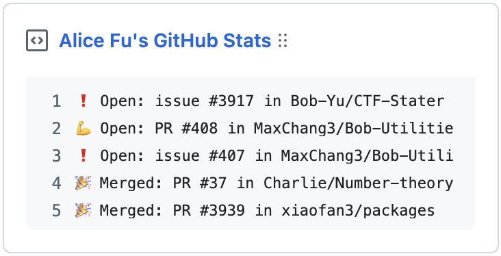

<p align="center">
  
  <p align="center">⚡️📌 Update a pinned gist to show your latest GitHub activity</p>
</p>

<p align="right"><i>
  Originally from  <a href="https://github.com/JasonEtco/activity-box">JasonEtco/activity-box</a>.
</i></p>

# github-activity-box

[](https://www.npmjs.com/package/github-activity-box)
[](https://github.com/maxchang3/github-activity-box/actions)
[](https://biomejs.dev)
[](LICENSE)

## ✨ Enhancements

- 🔍 Uses GraphQL API to search for issues and PRs **authored** by the provided username.
- 🎨 Supports custom descriptions and filtering by specific repos/owners
- ✅ Updated dependencies, rewritten to TypeScript, and refactored the tests.
- 📦 Published to npm with binary support for easy use via `npx` or `pnpx`

> [!NOTE]
>
> The original implementation fetched events initiated by the user (so PRs merged by others aren't counted).
> 
> Currently, multiple states of the same PR, such as opening and merging, won't be retrieved. Also, comment events are not included.

## 🚀 Usage

### Use as a CLI

```bash
# Run directly with npx/pnpx
npx github-activity-box [options]

# Or install globally
npm install -g github-activity-box
github-activity-box [options]
```

**Options:**
- `--dry` - Preview output without updating the gist

**Required Environment Variables:**
| Variable        | Description                                                                                              |
| --------------- | -------------------------------------------------------------------------------------------------------- |
| `GIST_ID`       | ID portion from your gist URL (`https://gist.github.com/username/GIST_ID`)                               |
| `GH_PAT`        | GitHub personal access token with `gist` scope                                                           |
| `GH_USERNAME`   | Your GitHub username                                                                                     |
| `DESCRIPTION`   | (Optional) Description for the gist                                                                      |
| `EXCLUDE_REPO`  | (Optional) Comma-separated list of repositories to exclude <br> Example: `username/repo1,username/repo2` |
| `EXCLUDE_OWNER` | (Optional) Comma-separated list of owners to exclude <br> Example: `username1,username2`                 |

### GitHub Action Setup

#### Prerequisites

1. Create a new public [GitHub Gist](https://gist.github.com/)
2. Generate a [personal access token](https://github.com/settings/personal-access-tokens) with `gist` scope

#### Workflow Configuration

Create `.github/workflows/activity-box.yml`:

```yml
name: Activity Box
on:
  workflow_dispatch:
  schedule:
    - cron: '*/30 * * * *'  # Updates every 30 minutes

jobs:
  update-activity:
    runs-on: ubuntu-latest
    steps:
      - name: Checkout
        uses: actions/checkout@v4

      - name: Install pnpm
        uses: pnpm/action-setup@v4
        with:
          version: 10
          run_install: false

      - name: Setup Node.js
        uses: actions/setup-node@v4
        with:
          node-version: 20
          cache: pnpm

      - name: Update activity
        run: npx github-activity-box@0
        env:
          GH_PAT: ${{ secrets.GH_PAT }}
          GITHUB_TOKEN: ${{ secrets.GITHUB_TOKEN }}
          GH_USERNAME: your-username
          GIST_ID: your-gist-id
          # You can also use hardcoded values instead of variables
          # EXCLUDE_OWNER: username1,username2
          # EXCLUDE_REPO: username/repo1,username/repo2
          EXCLUDE_OWNER: ${{ vars.EXCLUDE_OWNER }}
          EXCLUDE_REPO: ${{ vars.EXCLUDE_REPO }}
          DESCRIPTION: Your custom description
```

### Add Repository Secrets and Variables

1. Go to your repository **Settings** > **Secrets and variables** > **Actions**.
2. Add a repository secret:
   - `GH_PAT`: Your GitHub access token (requires `gist` and `metadata:read` scopes).
3. (Optional) Add repository variables as needed (`EXCLUDE_OWNER`, `EXCLUDE_REPO`).

---

_Inspired by [matchai/bird-box](https://github.com/matchai/bird-box) and forked from [JasonEtco/activity-box](https://github.com/JasonEtco/activity-box)_
